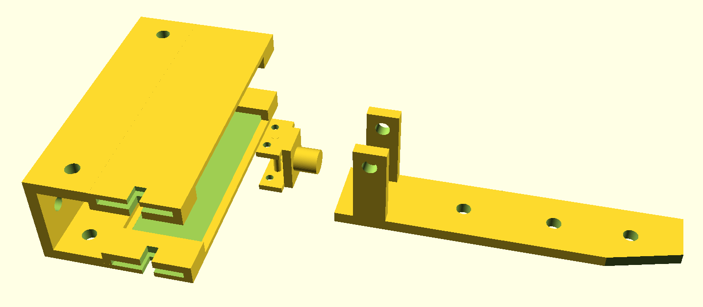
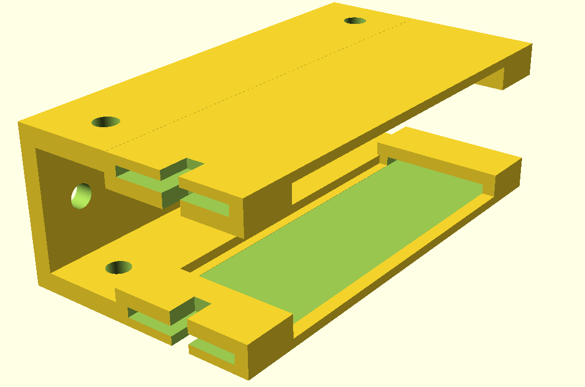
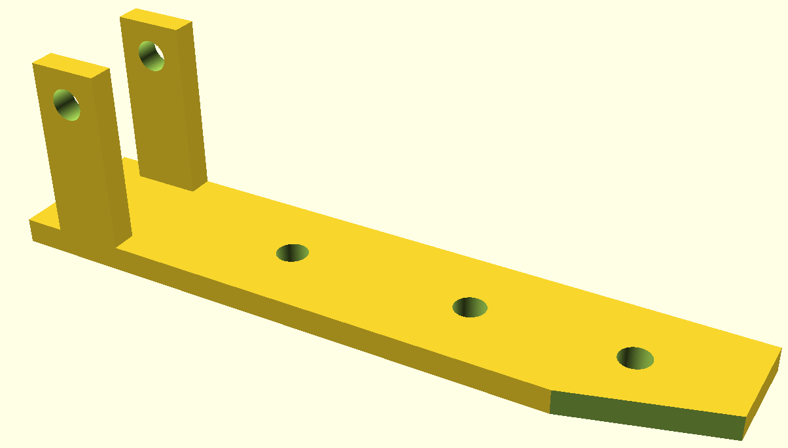
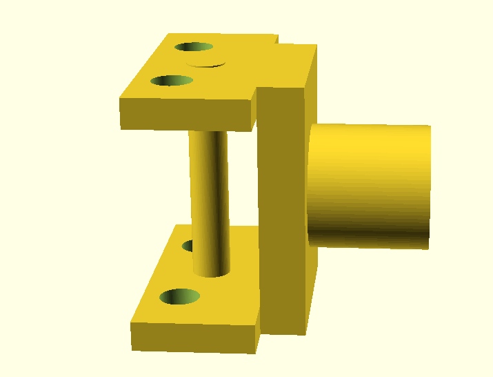

# robot_auto_charging




### part 1: main dock


```
dock_walmart();
```



### part 2: plug holder

```
    //plug_holder1(); 
    difference(){
    plug_holder2(); 
        translate([85, -25, -25])
        rotate([0,0,16])
        cube([30,30,20]);
    }
```



### part 3: bump switch
```
bump_switch();
////bump switch connector.
cylinder(h=17, d=2.6, center=true);
```


