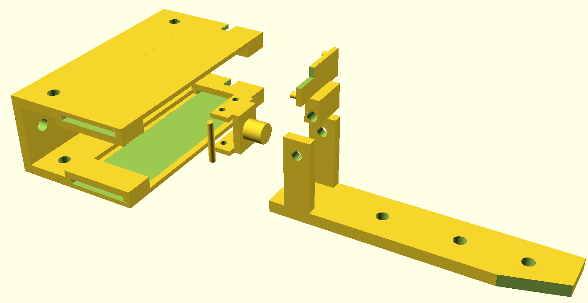
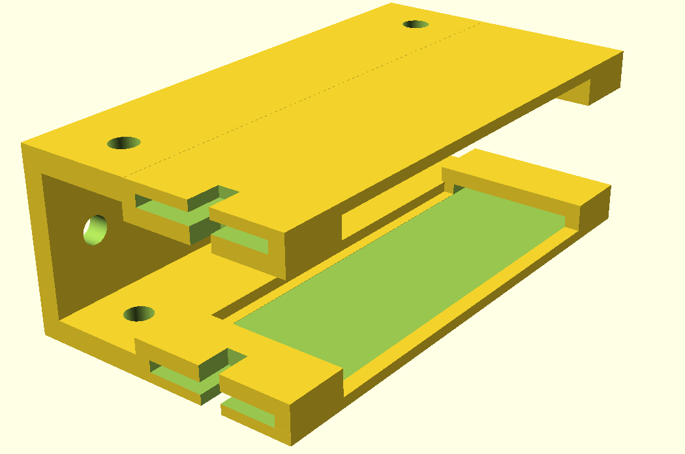
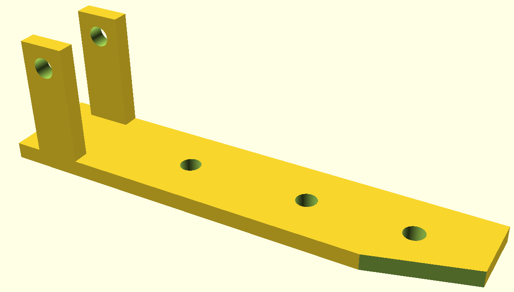
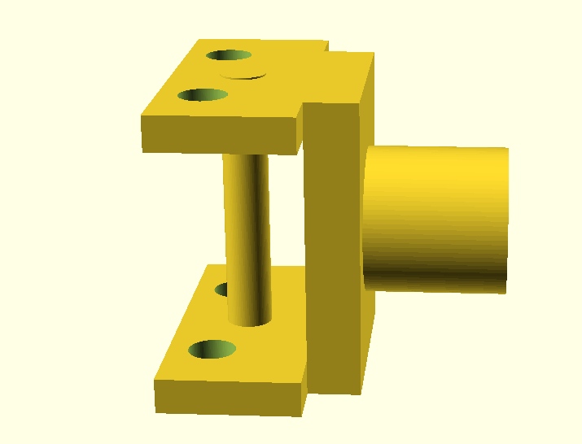
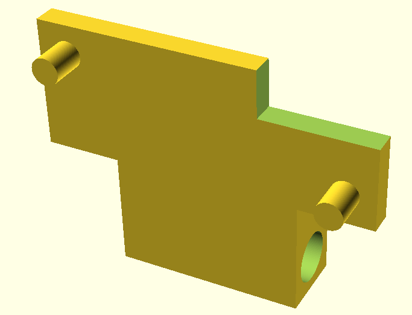
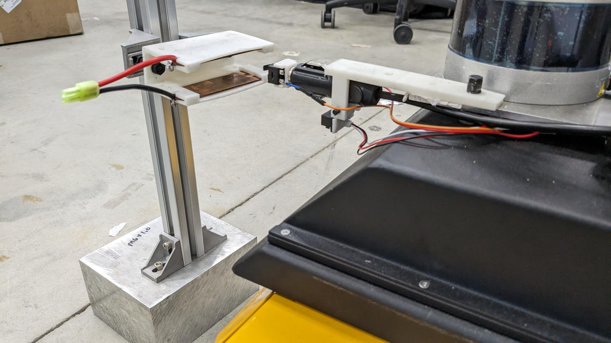

# robot_auto_charging




### part 1: main dock


```
dock_walmart();
```



### part 2: plug holder

```
    //plug_holder1(); 
    difference(){
    plug_holder2(); 
        translate([85, -25, -25])
        rotate([0,0,16])
        cube([30,30,20]);
    }
```



### part 3: bump switch
```
bump_switch();
////bump switch connector.
cylinder(h=17, d=2.6, center=true);
```


### Part 4: Sensor Mount




### To Reproduce:
* print all the files inside /toreproduce folder.
* (This or similar item) https://www.amazon.com/ROSZNN-Lifepo4-Bus-Connector-Thickness/dp/B0BMXJ26R2/
* (Worked with a similar product bought from walmart) https://www.amazon.com/12Volt-Replacement-Cigarette-Lighter-Leads/dp/B08Q39MQRF

* Sensor: (or similar GP2Y0A51SK0F) https://www.amazon.com/dp/B07KW33DVG
* (Bump sensor or Similar) https://www.amazon.com/dp/B07MW2RPJY

* Use any arduino to read this sensors. Standard switch and proximity sensor code will work.


### Working Model



